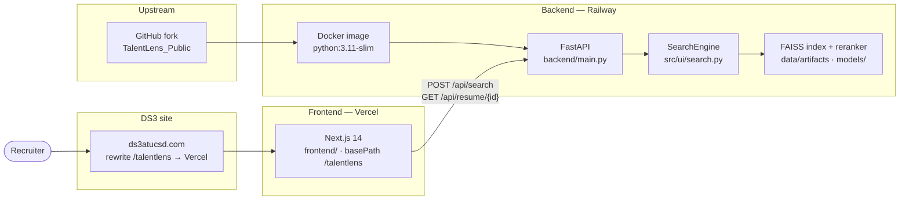

# TalentLens (DS3)

Semantic resume search and ranking for DS3 recruiters. This repo extends the public [TalentLens](https://github.com/ds3ucsd/TalentLens_Public) NLP stack with a **FastAPI** service and a **Next.js** recruiter UI, while keeping the original **Streamlit** prototype runnable for comparison.

| Surface | URL (example) |
|--------|----------------|
| Production UI | https://ds3atucsd.com/talentlens |
| Streamlit prototype (reference) | https://talentlenspublic-nakqyg2siefop4zhwucjcq.streamlit.app/ |

---

## Architecture



**Request path:** browser loads the Next app under `/talentlens` → debounced search calls the Railway API → `SearchEngine` retrieves chunks (FAISS + BM25), applies sidebar filters, cross-encoder reranks, optional Grok scoring → JSON results rendered as cards and detail pages.

---

## Repository layout

| Path | Purpose |
|------|---------|
| `backend/main.py` | FastAPI app (wraps `SearchEngine`; does not replace Streamlit) |
| `frontend/` | Next.js 14 App Router UI (`basePath`: `/talentlens`) |
| `src/ui/` | Streamlit app + shared retrieval (`search.py`, `app.py`) |
| `src/pipeline/` | Offline notebooks / rebuild docs |
| `data/artifacts/` | FAISS index and resume metadata |
| `models/talentlens-cross-encoder-sft-v1/` | Fine-tuned cross-encoder (committed) |
| `Dockerfile` | Production backend image (Railway / local Docker) |

---

## Local development

Use **Python 3.11+** on the backend (3.14 works locally; Docker uses 3.11). On Windows, use `python` and PowerShell paths below—not `python3` or `source`.

### 1. Backend (FastAPI)

From the **repository root**:

```powershell
python -m venv .venv
.\.venv\Scripts\Activate.ps1
pip install -r requirements.txt -r backend/requirements.txt
```

Prefetch the embedding model once (required for `SearchEngine` startup):

```powershell
python -c "from sentence_transformers import SentenceTransformer; SentenceTransformer('all-MiniLM-L6-v2')"
```

Copy env and set secrets:

```powershell
copy .env.example .env
# Edit .env — set XAI_API_KEY for Grok scoring (optional but recommended)
```

Run the API (must run from repo root so `data/` resolves):

```powershell
uvicorn backend.main:app --reload --host 0.0.0.0 --port 8000
```

- Health: http://localhost:8000/health  
- OpenAPI: http://localhost:8000/docs  

**Docker (optional):**

```powershell
docker build -t talentlens-backend .
docker run -p 8000:8000 --env-file .env talentlens-backend
```

### 2. Frontend (Next.js)

In a **second terminal**:

```powershell
cd frontend
copy .env.local.example .env.local
npm install
npm run dev
```

Open http://localhost:3000/talentlens  

Ensure the backend allows your origin: `FRONTEND_ORIGINS=http://localhost:3000` (default).

### 3. Streamlit prototype (optional, unchanged)

```powershell
# From repo root, venv activated
streamlit run src\ui\app.py
```

Runs on http://localhost:8501 independently of the FastAPI/Next stack.

---

## Environment variables

### Backend (`.env` at repo root, or Railway service variables)

| Variable | Required | Description |
|----------|----------|-------------|
| `XAI_API_KEY` | Recommended | xAI key for Grok JD parsing and match explanations |
| `FRONTEND_ORIGINS` | For production | Comma-separated CORS origins (default `http://localhost:3000`) |
| `TALENTLENS_GROK_MAX_WORKERS` | No | Parallel Grok calls (default `6` in `src/ui/search.py`) |
| `TALENTLENS_DISABLE_RERANKER` | 1 GB hosts | Set to `1` to skip cross-encoder load (avoids OOM) |
| `TALENTLENS_STRICT_STARTUP` | No | `1` = fail boot if backends missing (default `0` when reranker disabled) |
| `PORT` | Railway | HTTP port (Railway sets this; Docker defaults to `8000`) |

### Frontend (`frontend/.env.local`, or Vercel project env)

| Variable | Required | Description |
|----------|----------|-------------|
| `NEXT_PUBLIC_API_URL` | Yes | Backend base URL, e.g. `https://your-app.up.railway.app` (no trailing slash) |
| `NEXT_PUBLIC_SITE_URL` | For share links | Public site origin, e.g. `https://ds3atucsd.com` (used by “Copy link” on resume pages) |

See `.env.example` and `frontend/.env.local.example` for templates.

---

## Deployment

### Backend → Railway

1. Create a Railway project and connect this GitHub repo.
2. Set **builder** to Dockerfile (repo root `Dockerfile`).
3. Add service variables: `XAI_API_KEY`, `FRONTEND_ORIGINS` (include your Vercel URL and `https://ds3atucsd.com`).
4. **If the plan is 1 GB RAM** (logs show `Killed`), add `TALENTLENS_DISABLE_RERANKER=1` and optionally `TALENTLENS_GROK_MAX_WORKERS=2`. This skips the cross-encoder (~500MB+) but keeps FAISS + Grok search working.
5. Deploy; note the public HTTPS URL (e.g. `https://talentlens-api.up.railway.app`).
6. Confirm `GET /health` returns `{"status":"ok"}`.

Railway injects `PORT`; the image CMD runs `uvicorn backend.main:app` on that port.

### Frontend → Vercel

1. Import the repo in Vercel; set **Root Directory** to `frontend`.
2. Framework preset: **Next.js** (build `npm run build`, output default).
3. Environment variables:
   - `NEXT_PUBLIC_API_URL` → Railway backend URL
   - `NEXT_PUBLIC_SITE_URL` → `https://ds3atucsd.com`
4. Deploy. Vercel preview URL will be something like `https://your-project.vercel.app/talentlens` (respects `basePath` in `frontend/next.config.js`).

### DS3 rewrite (`ds3atucsd.com/talentlens`)

Point the club site at the Vercel deployment under the `/talentlens` path. Typical options:

- **Reverse proxy** (nginx/Caddy): `location /talentlens { proxy_pass https://your-project.vercel.app/talentlens; }`
- **Vercel custom domain** with path routing, or a subdomain that redirects to `/talentlens`

After go-live, set backend `FRONTEND_ORIGINS` to include `https://ds3atucsd.com` so browser CORS succeeds.

---

## API (summary)

| Method | Path | Body / params |
|--------|------|----------------|
| `GET` | `/health` | — → `{"status":"ok"}` |
| `POST` | `/api/search` | `{ "query": string, "top_k": number, "filters": object }` |
| `GET` | `/api/resume/{resume_id}` | Full candidate profile |

**`filters` keys** (all optional): `skill_filters` / `skills`, `grad_year_min`, `grad_year_max`, `role_type` (`intern` \| `new_grad` \| `experienced`), `major_filter`, `input_mode` (`Job Description` default).

Filters are applied in `SearchEngine._apply_post_retrieval_filters()` **after retrieval/aggregation and before reranking**.

---

## Improvements over the Streamlit prototype

The Streamlit app (`src/ui/app.py`) remains the reference implementation. The Next.js + FastAPI stack improves the recruiter experience in concrete ways:

- **Debounced search (300 ms)** — fewer API calls while typing; Streamlit reruns on every keystroke-style interaction.
- **Mobile-responsive layout** — filter sidebar collapses into a shadcn **Sheet** on small screens; responsive results grid (`sm:grid-cols-2`).
- **Perceived latency** — skeleton card placeholders during fetch instead of a blocking full-page rerun.
- **Keyboard navigation** — ↑/↓ to move selection across results, Enter to open the selected resume (when not focused in an input).
- **Query-term highlighting** — matched tokens in snippets wrapped in `<mark>` (`frontend/lib/highlight.tsx`).
- **Server-backed filters** — skills (must match all), graduation year range, role type, and major applied on the backend before reranking; sidebar stays in sync with API behavior.
- **Dedicated resume detail route** — `/talentlens/resume/[id]` with shareable URL and **Copy link** + toast.
- **Recruiter affordances** — query suggestions dropdown, last-five search history, bookmark **Save** + `/talentlens/saved` page (localStorage).
- **Visual design system** — Geist typography, violet DS3 theme, sticky shrinking header, match score ring with tier colors, card hover states, staggered result animation.
- **Dark mode** — system/light/dark via `next-themes`, persisted in `localStorage`.
- **Accessibility** — skip link, semantic landmarks, focus rings, `sr-only` labels, `role="alert"` on errors.
- **Separation of concerns** — UI on Vercel, API on Railway; Streamlit can still run locally without blocking production deploys.

---

## Submission checklist

Maps each deliverable from the project spec to where it is implemented. Use this before submitting links to graders.

| Requirement | Satisfied by |
|-------------|----------------|
| Fork / extend public TalentLens repo without breaking the prototype | This repo; Streamlit still runs via `streamlit run src\ui\app.py` |
| FastAPI backend wrapping `src/ui` retrieval (no replacement of core search code) | `backend/main.py` imports `SearchEngine` from `src/ui/search.py` |
| `GET /health` → `{"status":"ok"}` | `backend/main.py` → `health()` |
| `POST /api/search` with `{ query, top_k, filters }` | `backend/main.py` → `search_resumes()` |
| `GET /api/resume/{resume_id}` | `backend/main.py` → `get_resume()` |
| CORS from `FRONTEND_ORIGINS` (comma-separated, default localhost:3000) | `backend/main.py` middleware |
| Backend-only deps in `backend/requirements.txt` | `fastapi`, `uvicorn[standard]`, `python-multipart`, `pydantic` |
| Dockerfile (`python:3.11-slim`, system deps, uvicorn on `$PORT`) | Root `Dockerfile` + `.dockerignore` |
| Deploy backend to **Railway** | Dockerfile-based service; see [Deployment → Railway](#backend--railway) |
| Next.js 14 frontend (App Router, TypeScript, Tailwind, ESLint) | `frontend/` |
| `basePath` / `assetPrefix` = `/talentlens` | `frontend/next.config.js` |
| Live API (not mock data) | `frontend/lib/api.ts` → `NEXT_PUBLIC_API_URL` |
| Search UI: header, debounced input, filters, results grid, skeletons, empty state, timing | `frontend/app/page.tsx`, `components/site-header.tsx`, `results-section.tsx` |
| Filters: skills (all required), grad year range, role type | `components/filter-panel.tsx` → `lib/filters.ts` → API; `src/ui/search.py` `_apply_post_retrieval_filters` |
| Resume cards: name, skills, score, highlighted snippet | `components/resume-card.tsx`, `match-score-ring.tsx` |
| Resume detail page | `frontend/app/resume/[id]/page.tsx` |
| Query suggestions while typing | `lib/query-suggestions.ts`, `components/search-autocomplete.tsx` |
| Search history (last 5, localStorage) | `lib/search-history.ts` |
| Copy public resume link + toast | `components/resume-detail-view.tsx`, `lib/public-url.ts`, `components/toast-provider.tsx` |
| View / Save on cards; saved list page | `components/resume-card.tsx`, `app/saved/page.tsx`, `lib/saved-resumes.ts` |
| Deploy frontend to **Vercel** | `frontend/` root directory; see [Deployment → Vercel](#frontend--vercel) |
| Served under **ds3atucsd.com/talentlens** | `basePath` + DS3 reverse proxy / custom domain; `NEXT_PUBLIC_SITE_URL` for share URLs |
| Mobile-first responsive UI | Tailwind breakpoints, filter `Sheet`, compact header |
| Document env vars and local dev | This README + `.env.example` + `frontend/.env.local.example` |

---

## Data pipeline & Discord resumes

Offline indexing (FAISS, metadata, cross-encoder) is documented in `src/pipeline/PIPELINE.md` and `src/pipeline/current_pipeline.md`.

Discord resume assets live on Dropbox (not in git). To download into `data/discord/`:

```bash
cd data/discord
python download_from_dropbox.py "<dropbox-shared-folder-link>"
```

See `data/discord/` scripts for upload/download details.

---

## License & attribution

Built on the DS3 TalentLens public dataset and retrieval stack. **Do not commit real API keys** — use `.env` locally and platform secret stores in production.
